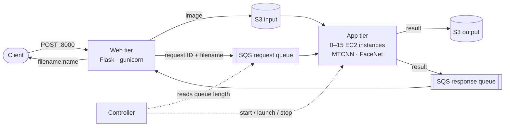

# Elastic Face Recognition — Project 1

An elastic face-recognition service on AWS, built for CSE 546 (Cloud Computing). A client uploads an image over HTTP, the service detects and recognises the face, and the reply is plain text: `filename:name`.

It is split into a **web tier** and an **app tier**. A **controller** I wrote watches the request queue and starts and stops app-tier EC2 instances to match the load, up to 15.

## Architecture



**How a request flows**

1. The client POSTs an image to the web tier on port 8000.
2. The web tier stores it in the input S3 bucket and puts a request, with a unique ID, on the request queue.
3. An app-tier instance takes the request and fetches the image from S3.
4. It runs MTCNN (detection) and FaceNet (recognition, VGGFace2 weights), writes the result to the output bucket and puts it on the response queue.
5. The web tier waits up to 120 seconds for the reply that matches its request ID and returns it.

**The controller** (`controller/controller.py`) runs every 10 seconds:

- It reads the request queue's length and aims for one instance per waiting message, capped at 15.
- It restarts stopped instances first, then launches new ones from the app-tier AMI.
- After three idle checks in a row it **stops** all running instances. They are stopped, not terminated, so they can be restarted.

The web tier and the controller run as two containers on one EC2 host (`compose.yaml`).

## Repository layout

```text
web-tier/                Flask server: upload to S3, queue the request, wait for the reply
controller/              scales the app tier by request-queue length
packer-ami-build/        builds the app-tier AMI
  app-tier-ami.pkr.hcl     Ubuntu 22.04 base image
  app-tier.sh              installs dependencies, writes the env file, creates the systemd service
  app-tier-files/          the worker (backend.py) and the face-matching code
Terraform/               network, instance, S3, SQS and IAM
compose.yaml             web tier and controller side by side on the host
test/                    12 test functions (see Tests)
.github/workflows/       deployment.yaml
```

## Infrastructure (Terraform)

23 resources, with state kept in an S3 backend:

- a VPC with one public subnet, an internet gateway, a route table and a security group;
- the web host: one EC2 instance with a key pair and an Elastic IP;
- two S3 buckets (input and output), each with a public-access block and a policy;
- two SQS queues (request and response) with their policies;
- an IAM role, policy attachment and instance profile for the app tier.

Variables: `public_key` and `private_key` (SSH key contents; if left empty, Terraform reads `~/.ssh/id_ed25519[.pub]`) and `region` (default `us-east-1`). Outputs include the instance IP, the Elastic IP, both queue URLs, the security group ID and the instance profile.

## The app-tier AMI (Packer)

Packer starts from the latest Ubuntu 22.04 image, copies `app-tier-files/` onto it and runs `app-tier.sh`, which writes `/etc/app-tier.env` (queue URLs and bucket names), installs the Python dependencies including CPU-only PyTorch, and creates a systemd service that runs the worker. Put the resulting AMI ID in the controller's `AMI_ID` setting.

The worker needs `data.pt` (the reference face embeddings) and the model weights in `app-tier-files/`. They come from the course, are git-ignored, and are **not included here**.

## Delivery (GitHub Actions)

`deployment.yaml` runs on a push to `main`:

1. **deploy-infra**: Terraform init, plan and apply. (A destroy step exists but is switched off with `if: false`.)
2. **deploy-app**: builds the web-tier and controller images (multi-stage, non-root) and pushes them to ECR, copies the env and compose files to the host, and deploys over SSH.

It expects the secrets `AWS_ACCESS_KEY_ID`, `AWS_SECRET_ACCESS_KEY`, `AWS_SSH_KEY_PRIVATE` and `AWS_SSH_KEY_PUBLIC`. **Actions are disabled in this public copy**, so nothing runs against AWS.

## Configuration

`compose.yaml` reads these from the environment: `REGISTRY`, `REPOSITORY`, `IMAGE_TAG`, `AWS_ACCESS_KEY_ID`, `AWS_SECRET_ACCESS_KEY`, `AWS_DEFAULT_REGION`, `INPUT_BUCKET_NAME`, `OUTPUT_BUCKET_NAME`, `SEND_QUEUE_URL`, `RECEIVE_QUEUE_URL` and `AMI_ID`.

## Using it

```bash
curl -F "inputFile=@test_000.jpg" http://<host-ip>:8000/
# test_000:Paul
```

## Tests

`test/` holds 12 test functions for the controller, the worker and the queue plumbing. They are **integration checks against live queues and buckets**, with no mocks, so they need real AWS resources and a local copy of the course's face dataset. Set `FACE_IMAGES_DIR` to point at it.

## Notes on this copy

- The AWS account ID `123456789012` and the `0000000000` in queue and bucket names are placeholders. Replace them with your own values.
- Course-provided material (the dataset, the answer file, the autograder and the class files) is not included and is git-ignored.
- The repository history includes an earlier first stage: a single web tier that looked results up in SimpleDB, before the queues, the app tier and the controller existed.

## Credits

- Autograder and course scripts (not included here): Kritshekhar Jha
- Infrastructure, web tier, controller and app tier: Shubhrajit Pallob

## License

MIT License
